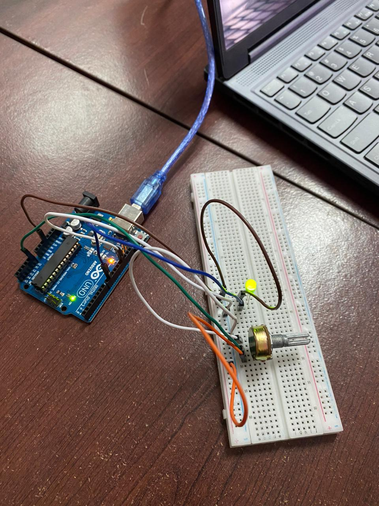

# Dokumentasi Praktikum 4B

## Dokumentasi

<video controls src="percoban4b-1.mp4" title="Percobaan 4B"></video>

## Komponen
1. LED : Sebagai indikator output PWM.
2. Resistor : Sebagai pembatas arus untuk melindungi LED.
3. Potensiometer : Sebagai input analog untuk mengatur nilai duty cycle.
4. Arduino Uno : Sebagai pusat pemrosesan data ADC ke PWM.

## Penjelasan
- Putaran Searah Jarum Jam: Meningkatkan nilai ADC, yang berakibat pada meningkatnya duty cycle PWM, sehingga LED semakin terang.
- Putaran Berlawanan Jarum Jam: Menurunkan nilai ADC, memperkecil duty cycle, sehingga LED meredup hingga mati.
- Respon Sistem: LED merespons perubahan input potensiometer dengan sangat halus tanpa adanya kedipan (flicker) yang terlihat, membuktikan frekuensi PWM bekerja dengan baik.