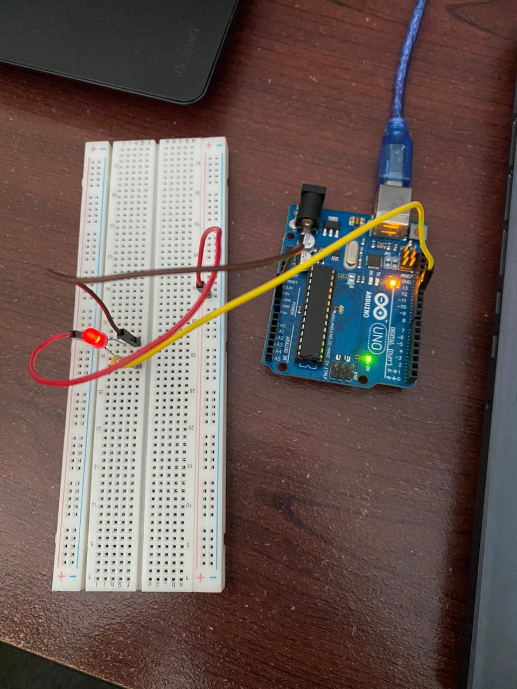
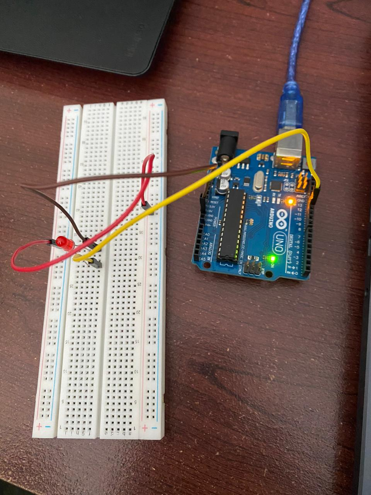

# Percobaan 3A - Mengontrol LED Menggunakan Serial Monitor

## Deskripsi
Percobaan ini bertujuan untuk mengontrol LED menggunakan komunikasi serial antara komputer dan Arduino Uno. Pengguna dapat mengirimkan karakter melalui Serial Monitor untuk menyalakan atau mematikan LED yang terhubung pada pin digital 12.

## Dokumentasi Percobaan
### 1. Kondisi LED Menyala
Saat karakter `'1'` dikirim melalui Serial Monitor, LED menyala karena pin 12 diberikan logika HIGH.

Hasil Pengamatan:
- LED menyala.
- Serial Monitor menampilkan pesan `LED ON`.
- Perintah berhasil diterima oleh Arduino.

### 2. Kondisi LED Mati
Saat karakter `'0'` dikirim melalui Serial Monitor, LED mati karena pin 12 diberikan logika LOW.

Hasil Pengamatan:
- LED mati.
- Serial Monitor menampilkan pesan `LED OFF`.
- Perintah berhasil diproses oleh Arduino.

## Analisis
Berdasarkan hasil percobaan, komunikasi serial dapat digunakan sebagai media input untuk mengendalikan perangkat output pada Arduino. Data yang dikirim dari Serial Monitor dibaca menggunakan fungsi `Serial.read()`, kemudian diproses untuk menentukan kondisi LED. Dengan metode ini, Arduino dapat berinteraksi secara langsung dengan pengguna melalui komputer.

## Kesimpulan
1. Arduino dapat menerima input dari Serial Monitor melalui komunikasi serial.
2. Karakter `'1'` digunakan untuk menyalakan LED.
3. Karakter `'0'` digunakan untuk mematikan LED.
4. Komunikasi serial memungkinkan pengendalian perangkat keras secara interaktif dan real-time.