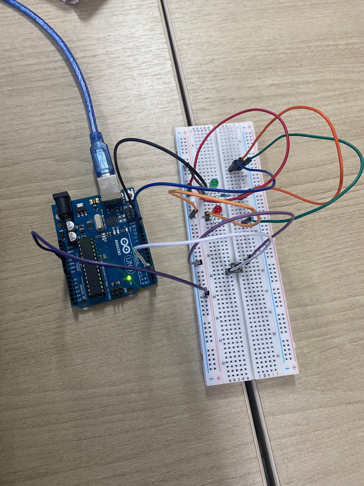

## Dokumentasi Percobaan

### Kondisi Awal

Pada kondisi awal, tombol belum ditekan sehingga interrupt belum terjadi. Variabel `ledState` bernilai `false` sehingga LED pada pin 13 berada dalam kondisi mati (OFF).

### Kondisi Setelah Tombol Ditekan

.jpeg)

Ketika tombol ditekan, pin 2 mendeteksi perubahan logika HIGH ke LOW (FALLING). Interrupt kemudian memanggil fungsi `tombolInterrupt()` yang mengubah nilai `ledState` menjadi kebalikan dari nilai sebelumnya.
Akibatnya LED pada pin 13 berubah dari kondisi mati (OFF) menjadi menyala (ON). Setiap kali tombol ditekan kembali, kondisi LED akan terus berganti antara ON dan OFF.

### Hasil Percobaan
Hasil percobaan menunjukkan bahwa LED dapat dikendalikan menggunakan mekanisme external interrupt. Sistem tidak perlu melakukan polling tombol secara terus-menerus karena Arduino hanya merespons ketika terjadi interrupt pada pin 2. Hal ini membuat sistem lebih efisien dan responsif.